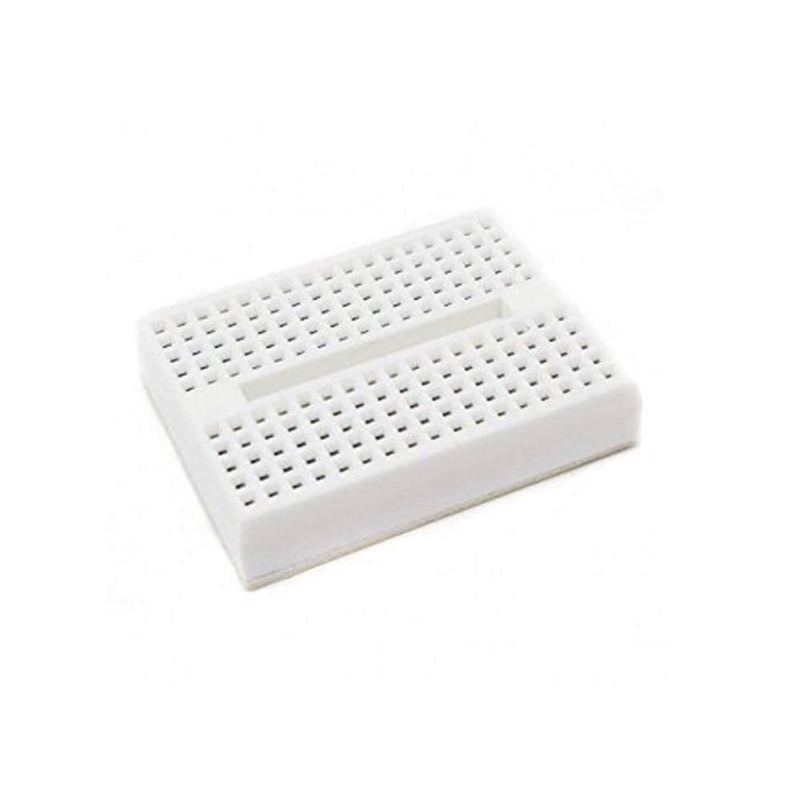
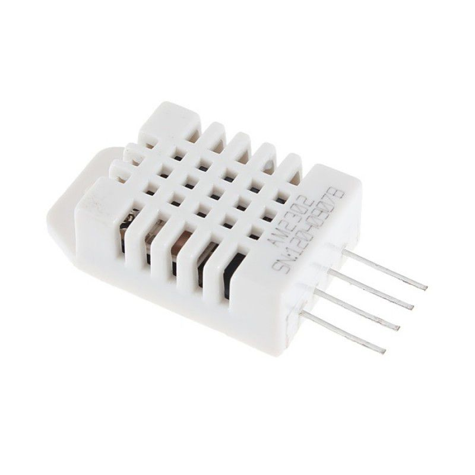
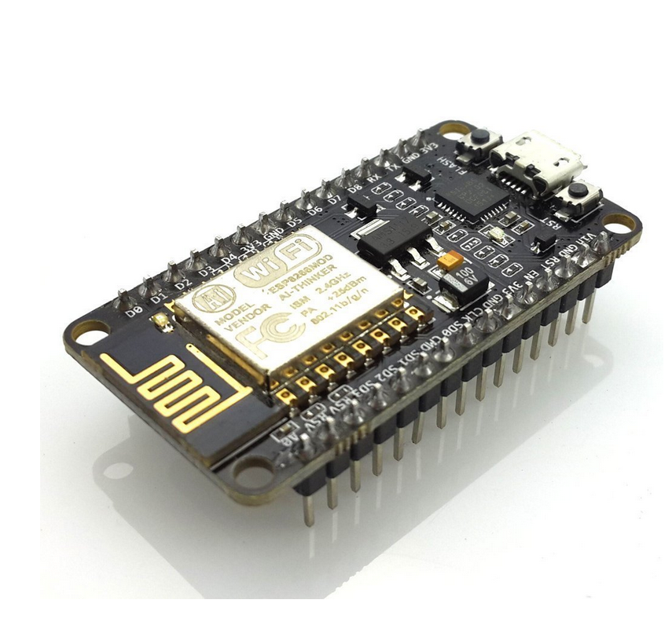
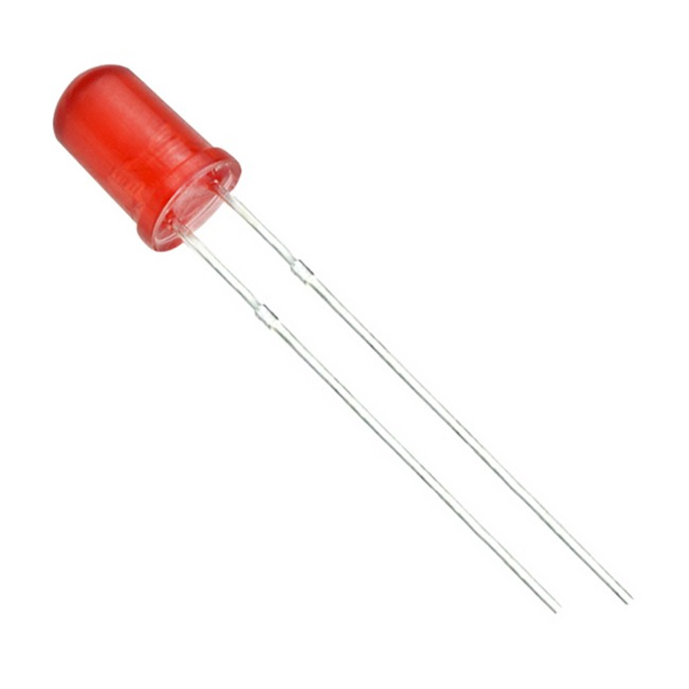
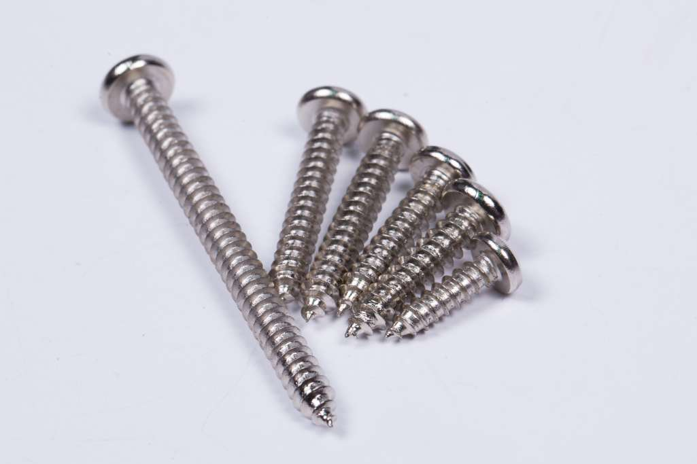
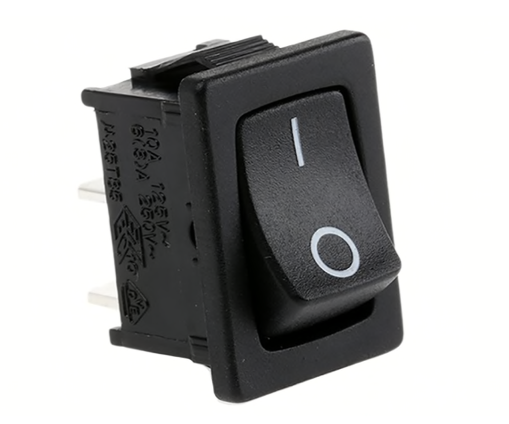

# DEVICE_
WEEK1-LAB001

       Mini Breadboard บอร์ดทดลองขนาดเล็ก 170 holes 

       {
          Weight : 35mm
          Length : 48mm 
          Height : 10mm
       }
     

      DHT22 
      {
         Weight : 14mm
         Length : 18mm 
         Height : 5.5mm
      }

     Node esp8266 
    {
        Weight : 24.5mm
        Length : 49mm 
        Height : 13mm
    }

    ชุดเปิด/ปิดไฟ 1 ช่องทาง (1 Ch. Relay Module) 
    {
       Weight : 26mm
       Length : 42mm 
       Height : 18mm
    }

    หลอดไฟแสดงผล ขนาด 3mm

    สกรูหัวกลม ขนาด 19mm
    {
       Diameter : 2mm
       Length : 19mm 
    }

    5PCS Black Mini Switch On/Off Push Button
    {
       Weight : 13mm
       Length : 19.2mm 
    }    

